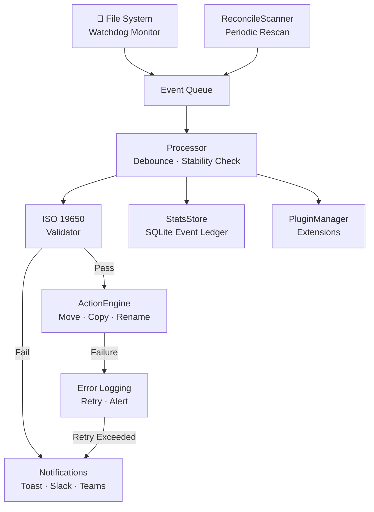
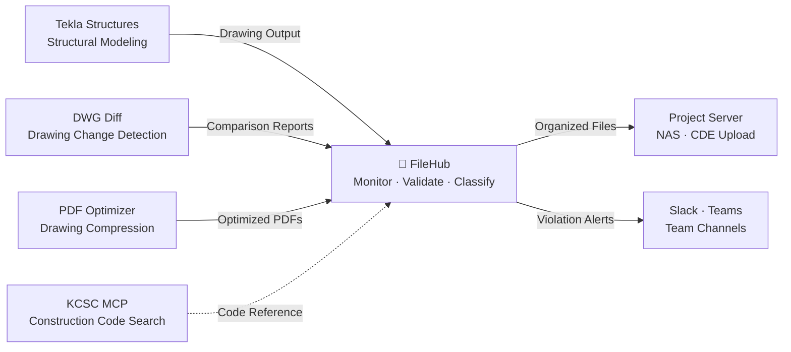

# FileHub
## Intelligent File Management for Construction Projects


---

## 🎯 What is FileHub?

**FileHub** is a unified file management hub that **automatically monitors, validates, and organizes** tens of thousands of files in construction and engineering project environments.

> **Target Users**: BIM Coordinators, Document Control Coordinators (DCC), Project Managers — designed for practitioners who manually review and classify hundreds of drawings, specifications, and reports every day.

Two engines power FileHub:

- **Digital Maknae** (File Naming Validator) — The current core of FileHub. Performs real-time validation against ISO 19650, automated file organization, notifications, and full audit trail tracking.
- **AI-IDSS** (Intelligent Document Identification System) — Integration planned. Automatically extracts document identity from PDF title blocks and detects revisions via visual fingerprinting (E-VIA). The goal is **content-based classification** for documents that cannot be identified by filename alone.

> Digital Maknae "reads the filename." AI-IDSS "reads inside the file." When both engines combine, blind spots in construction project file management disappear.

---

## 🔥 The Problem — Why FileHub?

| Existing Problem | How FileHub Solves It |
|---|---|
| Manually checking filename convention violations | Automatic real-time validation on every save |
| Organizing folders by hand | Rule-based automatic move / copy / rename |
| No visibility into file processing status | Full history tracked via SQLite event ledger |
| Late awareness of naming violations | Instant toast notifications + Slack / Teams delivery |
| Fragmented tooling | Single CLI + system tray for unified operation |

---

## ✅ Key Features

### 1. Real-Time Filename Validation (ISO 19650)
The moment a file is saved, its name is automatically validated against the **ISO 19650 international standard**.

```yaml
# Supported validation fields
- Project code, Originator / Recipient code
- Document type, Zone / Level code
- Revision number, Status code
- User-defined custom rules
```

### 2. Rule-Based Automatic File Organization
Files are **automatically moved, copied, or renamed** based on validation results.

```yaml
actions:
  - name: Archive approved files
    action: move
    trigger: valid          # On validation pass
    target: "E:/Archive/{year}/{month}"
    conflict: rename        # Auto-rename on conflict

  - name: Quarantine violations
    action: copy
    trigger: invalid        # On validation failure
    target: "E:/Quarantine"
```

### 3. Smart Notification System
- 💻 **Windows toast notifications** — Click to open file location directly
- 💬 **Slack / Teams webhooks** — Real-time delivery to team channels (async, non-blocking)
- 🔇 All notifications individually configurable

### 4. Persistent Event Ledger (StatsStore)
All file processing history is automatically recorded in a **SQLite database**.

```
~/.filehub/stats.db
├── Processed file events
├── Validation results (pass / fail + reason)
└── Queue saturation events
```

Query anytime via CLI:
```bash
filehub stats
```

### 5. Folder Scaffolding & Cleanup CLI
```bash
# Batch analyze and organize folder structure
filehub organize "E:/01.Work/PROJECT" --target "E:/Sorted" --dry-run

# Instantly create EPC standard project folders
filehub scaffold epc_standard ./MyProject
```

### 6. Plugin System
Freely extend functionality via Python package entry points.

```python
class MyPlugin(PluginBase):
    @property
    def name(self) -> str:
        return "my_plugin"

    def on_file_ready(self, path, result): ...
    def on_validation_error(self, path, msg): ...
    def on_startup(self): ...
    def on_shutdown(self): ...
```

### 7. System Tray Integration
Runs quietly in the background. Instantly accessible via tray icon:
- Pause / Resume
- View current status
- Open settings

---

## 🏗️ Core Architecture



---

## 💪 Technical Strengths

| Area | Detail |
|------|--------|
| **Stability** | Files processed only after write operations fully complete (Stability Check) |
| **Deduplication** | Cooldown mechanism prevents repeated processing of the same file |
| **Network Drive Support** | Automatic fallback to polling observer |
| **Type Safety** | Full codebase under mypy strict checking |
| **Test Coverage** | 450+ unit and integration tests — all passing |
| **CI/CD** | GitHub Actions for automated lint, typecheck, and test |
| **Internationalization** | Full Korean / English support (i18n) |

---

## ⚖️ Comparison with Existing Solutions

| Criteria | Autodesk Docs / Aconex | Newforma | **FileHub** |
|---|---|---|---|
| **Deployment** | SaaS (cloud required) | On-premises server | `pip install` — local single executable |
| **License Cost** | Per-user annual subscription | Server license | MIT open source (free) |
| **Filename Validation** | Limited (platform-dependent) | Basic pattern matching | ISO 19650 dedicated validator + YAML custom rules |
| **Auto-Organization** | Works only inside the platform | Folder-level integration | Works across local / NAS / network drives |
| **Time to Deploy** | Weeks to months (infrastructure) | Days to weeks (server setup) | Minutes (install CLI, start immediately) |
| **Customization** | Vendor-dependent | Limited API | Freely extensible via Python plugins |
| **Offline Operation** | Not possible | Requires server | Fully offline capable |

> **FileHub's position**: Not a replacement for enterprise CDEs (Common Data Environments), but a solution for the **local file management blind spot that exists before CDE adoption or outside CDE boundaries**. Install in 5 minutes, define one YAML config, and start validating filenames and organizing files immediately.

---

## 🗺️ Vision & Roadmap

### Current (v0.1) — Foundation ✅
- Real-time monitoring, validation, and auto-organization
- Event ledger (StatsStore)
- Plugin system foundation

### Near Future (v0.2) — Insights
- [ ] **Insights Dashboard** — KPI, violation trends, document lifecycle visualization `Flet-based local GUI`
- [ ] **Search Index** — File metadata and content-based search `SQLite FTS5 full-text search`
- [ ] **Policy Engine** — Declarative YAML for classification, retention, and exceptions `Extends existing config system`

### Long-Term (v1.0) — Enterprise
- [ ] **Queue Persistence** — Resume event processing after app restart `SQLite WAL-based event journal`
- [ ] **Multi-Instance Support** — Coordinate multiple watcher servers `File lock-based leader election`
- [ ] **Web Dashboard** — Team-wide real-time file status monitoring `FastAPI + WebSocket`

---

## 🔗 Position in the Construction AI Tool Ecosystem

FileHub is not a standalone tool — it serves as the **file hub** at the center of a construction and engineering AI automation ecosystem.



| Connected Tool | Role | Relationship with FileHub |
|---|---|---|
| **Tekla MCP** | BIM structural modeling automation | FileHub receives drawings and reports from Tekla for filename validation and auto-classification |
| **DWG Diff** | CAD drawing change detection | FileHub organizes comparison outputs by revision |
| **PDF Optimizer** | Drawing PDF compression | FileHub moves optimized PDFs to final delivery folders |
| **KCSC MCP** | Korean construction code search | Reference for validating standard codes within filenames |
| **AI-IDSS** | Content-based PDF document identification | Integrates as FileHub plugin — performs content-based secondary classification after filename validation |

> When each tool operates independently, it is just an "automation script." Connected through FileHub, they form a **hands-free pipeline from drawing output to final delivery folder**.

---

## 🚀 Quick Start

```bash
# Install
pip install -e ".[full]"

# Run (system tray)
filehub watch

# Validate a single file
filehub validate "D:/Project/drawing.pdf"

# Preview folder organization
filehub organize "D:/Work" --target "D:/Sorted" --analyze-only
```

---

> **FileHub** — File management is not a human's job.
> Define the rules. FileHub handles the rest.
