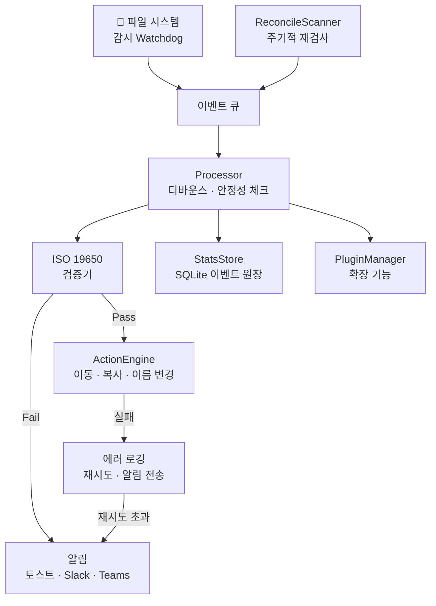
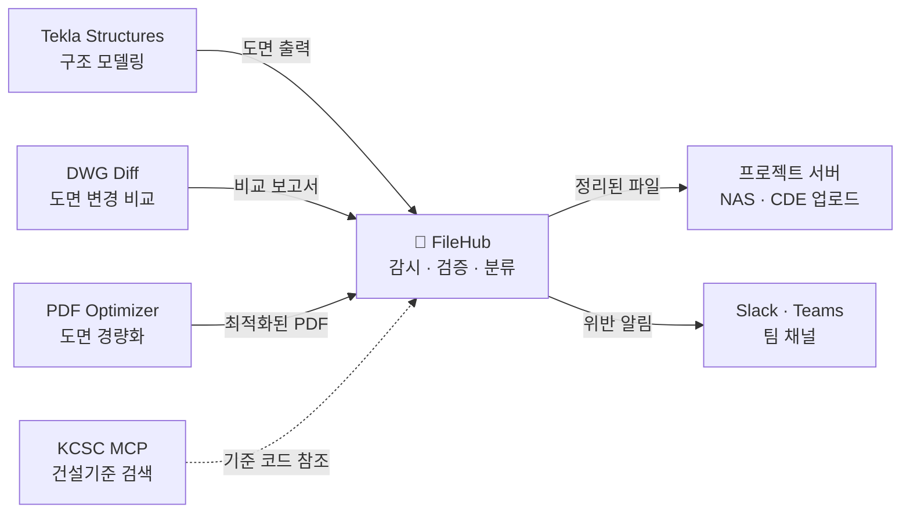

# FileHub
## 파일을 지능적으로 관리하다


---

## 🎯 FileHub란?

**FileHub**는 건설·엔지니어링 프로젝트 환경에서 수만 개의 파일을 **자동으로 감시하고, 검증하고, 정리하는** 통합 파일 관리 허브입니다.

> **대상 사용자**: BIM 코디네이터, 문서관리자(DCC), 프로젝트 관리자 — 매일 수백 건의 도면·시방서·보고서 파일을 수작업으로 검수·분류하는 실무자를 위해 설계되었습니다.

두 개의 엔진이 FileHub를 구동합니다:

- **Digital Maknae** (파일명 규칙 검증기) — 현재 FileHub의 핵심. ISO 19650 기반 실시간 검증·자동 정리·알림·이력 추적을 수행합니다.
- **AI-IDSS** (지능형 문서 식별 시스템) — 통합 예정. PDF 타이틀 블록에서 문서 정체성을 자동 추출하고, 시각적 핑거프린팅(E-VIA)으로 리비전을 감지합니다. 파일명만으로는 판별할 수 없는 문서를 **내용 기반으로 분류**하는 것이 목표입니다.

> Digital Maknae가 "파일명을 본다"면, AI-IDSS는 "파일 안을 본다". 두 엔진이 결합되면 건설 프로젝트 파일 관리의 사각지대가 사라집니다.

---

## 🔥 핵심 문제 — 왜 FileHub가 필요한가

| 기존 문제 | FileHub의 해결 방식 |
|-----------|---------------------|
| 파일명 규칙 위반을 수동으로 확인 | 저장 즉시 자동 실시간 검증 |
| 폴더 정리를 직접 해야 함 | 규칙 기반 자동 이동/복사/정리 |
| 파일 처리 현황 파악 불가 | SQLite 이벤트 원장으로 전 이력 추적 |
| 규칙 위반 발생 시 늦게 인지 | 즉시 토스트 알림 + Slack / Teams 전송 |
| 도구가 파편화되어 있음 | 하나의 CLI + 시스템 트레이로 통합 운영 |

---

## ✅ 주요 기능

### 1. 실시간 파일명 검증 (ISO 19650)
파일이 저장되는 순간, **ISO 19650 국제 표준**에 따라 파일명을 자동 검사합니다.

```yaml
# 지원 검증 항목
- 프로젝트 코드, 수신/발신자 코드
- 문서 유형, 구역/레벨 코드
- 리비전 번호, 상태 코드
- 사용자 정의 확장 규칙
```

### 2. 규칙 기반 자동 파일 정리
검증 결과에 따라 파일을 **자동으로 이동·복사·이름 변경**합니다.

```yaml
actions:
  - name: 승인 파일 보관
    action: move
    trigger: valid          # 검증 통과 시
    target: "E:/Archive/{year}/{month}"
    conflict: rename        # 충돌 시 자동 이름 변경
  
  - name: 위반 파일 격리
    action: copy
    trigger: invalid        # 검증 실패 시
    target: "E:/Quarantine"
```

### 3. 지능형 알림 시스템
- 💻 **Windows 토스트 알림** — 클릭 시 파일 위치 바로 오픈
- 💬 **Slack / Teams 웹훅** — 팀 채널로 실시간 전송 (비동기, Processor 차단 없음)
- 🔇 모든 알림은 설정에서 개별 제어 가능

### 4. 영속 이벤트 원장 (StatsStore)
모든 파일 처리 이력이 **SQLite DB**에 자동 기록됩니다.

```
~/.filehub/stats.db
├── 처리된 파일 이벤트
├── 검증 결과 (통과 / 실패 + 사유)
└── 큐 포화 이벤트
```

CLI 명령어로 언제든지 조회:
```bash
filehub stats
```

### 5. 폴더 스캐폴딩 & 정리 CLI
```bash
# 폴더 구조 일괄 분석 및 정리
filehub organize "E:/01.Work/PROJECT" --target "E:/Sorted" --dry-run

# EPC 표준 프로젝트 폴더 즉시 생성
filehub scaffold epc_standard ./MyProject
```

### 6. 플러그인 시스템
파이썬 패키지 엔트리포인트로 기능을 자유롭게 확장 가능합니다.

```python
class MyPlugin(PluginBase):
    @property
    def name(self) -> str:
        return "my_plugin"

    def on_file_ready(self, path, result): ...
    def on_validation_error(self, path, msg): ...
    def on_startup(self): ...
    def on_shutdown(self): ...
```

### 7. 시스템 트레이 통합
백그라운드에서 조용히 실행되며, 트레이 아이콘으로 즉시:
- 일시정지 / 재개
- 현재 상태 확인
- 설정 열기

---

## 🏗️ 핵심 아키텍처



---

## 💪 기술적 강점

| 항목 | 내용 |
|------|------|
| **안정성** | 파일 변경이 완전히 완료된 후에만 처리 (Stability Check) |
| **중복 방지** | 쿨다운 메커니즘으로 동일 파일 반복 처리 방지 |
| **네트워크 드라이브 지원** | 포링 옵저버 자동 전환 |
| **타입 안전** | 전체 코드베이스 mypy strict 검사 적용 |
| **테스트 커버리지** | 단위·통합 테스트 450건 이상 — 전수 통과 |
| **CI/CD** | GitHub Actions로 lint·typecheck·test 자동화 |
| **국제화** | 한국어 / 영어 완전 지원 (i18n) |

---

## ⚖️ 기존 솔루션과의 비교

| 비교 항목 | Autodesk Docs / Aconex | Newforma | **FileHub** |
|---|---|---|---|
| **배포 방식** | SaaS (클라우드 필수) | 온프레미스 서버 | `pip install` — 로컬 단일 실행 파일 |
| **라이선스 비용** | 사용자당 연간 수백만 원 | 서버 라이선스 | MIT 오픈소스 (무료) |
| **파일명 규칙 검증** | 제한적 (플랫폼 종속) | 기본 패턴 매칭 | ISO 19650 전용 검증 + YAML 커스텀 규칙 |
| **자동 정리 규칙** | 플랫폼 내부에서만 동작 | 폴더 연동 수준 | 로컬/NAS/네트워크 드라이브 무관 동작 |
| **도입 소요 시간** | 수주~수개월 (인프라 구축) | 수일~수주 (서버 세팅) | 수분 (CLI 설치 즉시 사용) |
| **커스터마이즈** | 벤더 의존 | 제한적 API | Python 플러그인으로 자유 확장 |
| **오프라인 동작** | 불가 | 서버 필요 | 완전한 오프라인 동작 |

> **FileHub의 포지션**: 대형 CDE(Common Data Environment)를 대체하는 것이 아니라, **CDE 도입 전 또는 CDE 바깥에서 발생하는 로컬 파일 관리 사각지대**를 해결합니다. 설치 5분, 설정 YAML 하나로 즉시 파일명 검증과 자동 정리를 시작할 수 있습니다.

---

## 🗺️ 비전 & 로드맵

### 현재 (v0.1) — 파운데이션 ✅
- 실시간 감시 · 검증 · 자동 정리
- 이벤트 원장 (StatsStore)
- 플러그인 시스템 기반

### 가까운 미래 (v0.2) — 인사이트
- [ ] **인사이트 대시보드** — KPI, 규칙 위반 트렌드, 문서 생명주기 시각화 `Flet 기반 로컬 GUI`
- [ ] **검색 인덱스** — 파일 메타데이터 및 내용 기반 검색 `SQLite FTS5 전문 검색`
- [ ] **정책 엔진** — 분류·보존·예외를 선언적 YAML로 정의 `기존 config 시스템 확장`

### 중장기 (v1.0) — 엔터프라이즈
- [ ] **큐 영속화** — 앱 재시작 후에도 이벤트 처리 재개 `SQLite WAL 기반 이벤트 저널`
- [ ] **멀티 인스턴스 지원** — 복수 감시 서버 조율 `파일 잠금 기반 리더 선출`
- [ ] **웹 대시보드** — 팀 전체가 실시간으로 파일 상태 모니터링 `FastAPI + WebSocket`

---

## 🔗 건설 AI 도구 생태계에서의 위치

FileHub는 단독 도구가 아니라, 건설·엔지니어링 AI 자동화 생태계의 **파일 허브** 역할을 합니다.



| 연동 도구 | 역할 | FileHub와의 관계 |
|---|---|---|
| **Tekla MCP** | BIM 구조 모델링 자동화 | Tekla에서 출력된 도면·보고서를 FileHub가 수신하여 파일명 검증 및 자동 분류 |
| **DWG Diff** | CAD 도면 변경 감지 | 변경 비교 결과물을 FileHub가 리비전별로 정리 |
| **PDF Optimizer** | 도면 PDF 경량화 | 최적화된 PDF를 FileHub가 최종 폴더로 이동 |
| **KCSC MCP** | 한국 건설기준 검색 | 파일명 내 기준 코드 검증 시 참조 가능 |
| **AI-IDSS** | PDF 내용 기반 문서 식별 | FileHub의 플러그인으로 통합 — 파일명 검증 이후 내용 기반 2차 분류 수행 |

> 각 도구가 개별적으로 동작할 때는 "자동화 스크립트"에 불과하지만, FileHub를 중심으로 연결되면 **도면 출력부터 최종 납품 폴더까지 사람 손이 닿지 않는 파이프라인**이 완성됩니다.

---

## 🚀 빠른 시작

```bash
# 설치
pip install -e ".[full]"

# 실행 (시스템 트레이)
filehub watch

# 파일 검증만 수행
filehub validate "D:/Project/drawing.pdf"

# 폴더 전체 정리 (미리보기)
filehub organize "D:/Work" --target "D:/Sorted" --analyze-only
```

---

> **FileHub** — 파일 관리는 사람이 할 일이 아닙니다.  
> 규칙을 정의하면, 나머지는 FileHub가 합니다.
